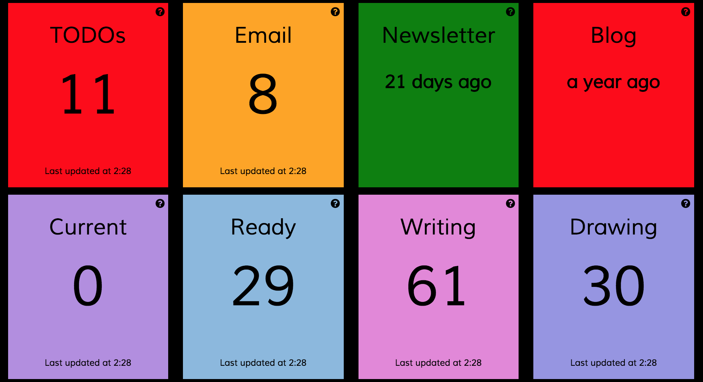

# Camille's dashboard

Dashing widgets that monitor various aspects of my life and work. For more details of each dashboard and widget, go the [dashboard home page](http://dashboard.camillebaldock.com).

## Widgets' code

I made my own widgets for a few importers.

Widget | Code
----- | ------
Boxen releases | [gist](https://gist.github.com/camilleldn/03e617de7bde53f179a2)
Forks to update | [gist](https://gist.github.com/camilleldn/1d4eedb3d6564b423bdd)
GitHub issues | [gist](https://gist.github.com/camilleldn/2aacd5153a15c7def1a3)
GitHub pull requests | [gist](https://gist.github.com/camilleldn/b73b963bf51956b459d5)
Travis | [gist](https://gist.github.com/camilleldn/e83b1859d385b05f214e)
Gemnasium | [gist](https://gist.github.com/camilleldn/f8a5d9487a6ecb019b88)
StatusCake | [gist](https://gist.github.com/camilleldn/ba2e46052dc8da7b9624)
Project Euler | [gist](https://gist.github.com/camilleldn/a29450249721e1686cb8)
Wunderlist | [gist](https://gist.github.com/camilleldn/1092f66251ad1461b473)
Email | [gist](https://gist.github.com/camilleldn/10709a0ec6b25323f1cb)
Trello | [gist](https://gist.github.com/camilleldn/cda910d857f4c6225f75)
Feedly RSS | [gist](https://gist.github.com/camilleldn/e7756c5067bc11323aee)
Pocket | [gist](https://gist.github.com/camilleldn/faff5cd21dee6a64867a)
Books | [gist](https://gist.github.com/camilleldn/4f873e77cc625ba3632b)
Kindle books | [gist](https://gist.github.com/camilleldn/3eb233168e62fab96de2)
Plex | [gist](https://gist.github.com/camilleldn/b3df4f58efe938d05912)
PocketCasts | [gist](https://gist.github.com/camilleldn/40db50ad9bef72c7c304)
Quotes | [gist](https://gist.github.com/camilleldn/920042990c6f9c121f58)

## Deploy your own!

## Tech badges

